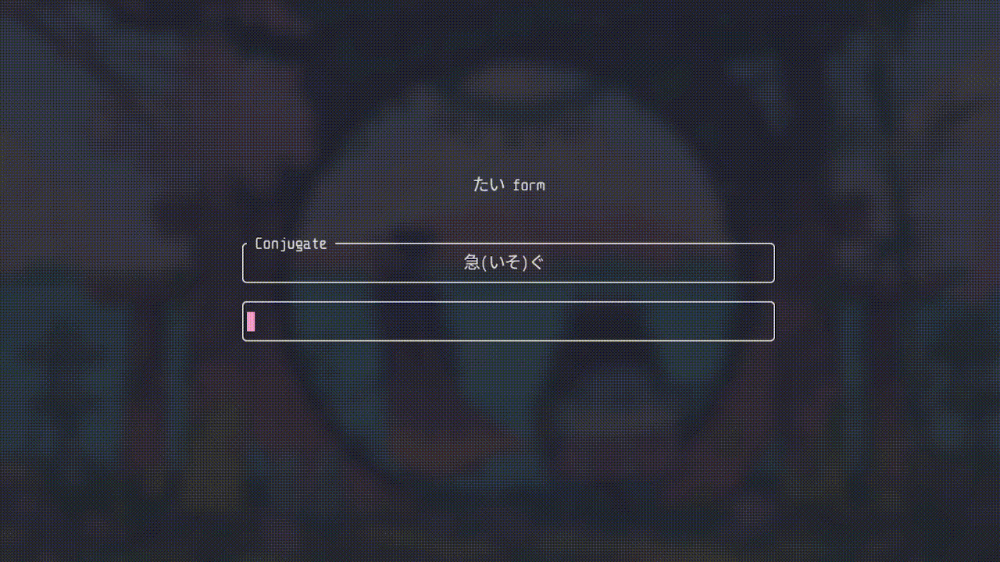

Practice your japanese conjugations in the comfort of your shell.

## Installation

Not published on cargo yet but you can build from source.

- Building from source code

  ```shell
  git clone https://github.com/gitKhym/jouzu-cli.git
  cd jouzu-cli
  cargo run
  ```

## Current Scope

- Conjugating adjectives
- Irregular verbs
- Choose different conjugations to practice
- Ability to extend word bank

## Disclaimer

Like many who are reading this text, I'm also in the process of learning this language, so some conjugations may be incorrect. Feedback and corrections are welcome!
